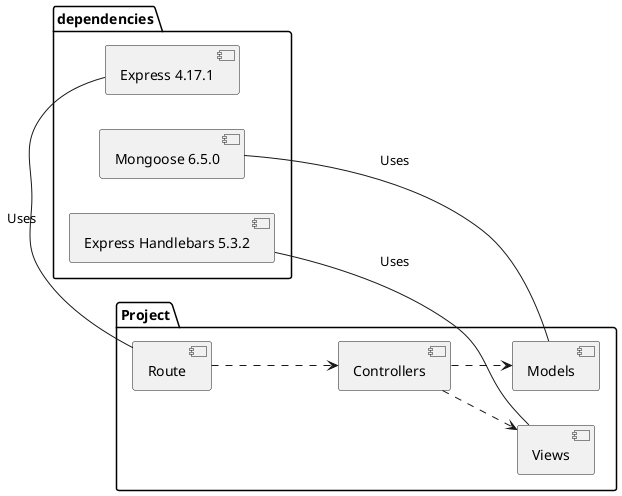

Template not autarization

dependencies  
-express  
-mongoose  
-express-handlebars



```
project
|-app
|	|-router
|	|	|-BlogRoute.js
|	|-controllers
|	|	|-PostController.js
|	|-\models
|		|-PostModel.js
|
|-views
|	|-layouts
|	|	|-main.hbs
|	|-partials
|	|	|-header.hbs
|	|	|-footer.hbs
|	|-blog.hbs
|
|-index.js
|-package.json
```
